 

### 👨‍💻 About

- Full-stack engineer building scalable, user-focused web apps
- Day to day: **Java, Spring Boot and MySQL**; also fluent in **Next.js, TypeScript and Node.js**
- Learning **PostgreSQL, system design and AI integrations**

 

### 🧰 Tech Stack

| | |
| :-- | :-- |
| **Languages** |     |
| **Backend** |     |
| **Frontend** |      |
| **Databases** |    |
| **Tools** |     |

 

### 📈 GitHub

<picture>
  <source media="(prefers-color-scheme: dark)" srcset="https://github-readme-stats.vercel.app/api?username=anuragbehura&show_icons=true&hide_border=true&bg_color=0D1117&title_color=58A6FF&icon_color=BC8CFF&text_color=C9D1D9&hide=prs,issues&count_private=true">
  <source media="(prefers-color-scheme: light)" srcset="https://github-readme-stats.vercel.app/api?username=anuragbehura&show_icons=true&hide_border=true&bg_color=FFFFFF&title_color=0969DA&icon_color=8250DF&text_color=24292F&hide=prs,issues&count_private=true">
  
</picture>
<picture>
  <source media="(prefers-color-scheme: dark)" srcset="https://github-readme-stats.vercel.app/api/top-langs/?username=anuragbehura&layout=compact&hide_border=true&bg_color=0D1117&title_color=58A6FF&text_color=C9D1D9">
  <source media="(prefers-color-scheme: light)" srcset="https://github-readme-stats.vercel.app/api/top-langs/?username=anuragbehura&layout=compact&hide_border=true&bg_color=FFFFFF&title_color=0969DA&text_color=24292F">
  
</picture>

 

### ✍️ Latest Writing

<!-- BLOG-POST-LIST:START -->- [Access and Refresh Tokens in Authentication&lpar;in simple way&rpar;](https://medium.com/@anuragbehura/access-and-refresh-tokens-in-authentication-in-simple-way-f2f0ed3238f7?source=rss-e32b3c6a0b45------2) · Jan 10, 2025- [JWT vs Session Authentication: Choosing the Right Approach for Your Web Application](https://medium.com/@anuragbehura/jwt-vs-session-authentication-choosing-the-right-approach-for-your-web-application-e3a7e73f327b?source=rss-e32b3c6a0b45------2) · Oct 11, 2024- [What is ChatGPT &amp; it’s uses in all fields ?](https://medium.com/@anuragbehura/what-is-chatgpt-its-uses-in-all-fields-541bd7bac23d?source=rss-e32b3c6a0b45------2) · Feb 5, 2023<!-- BLOG-POST-LIST:END -->
